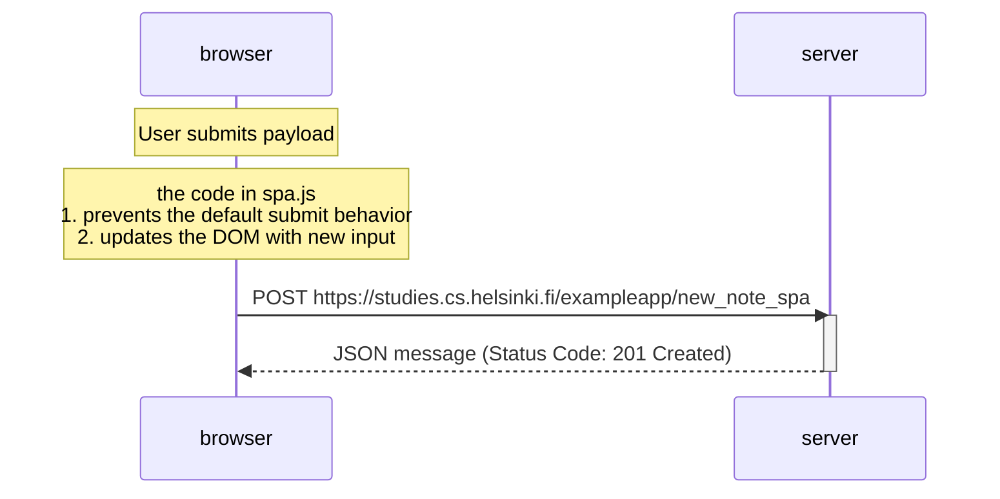

```mermaid
sequenceDiagram
participant browser
participant server
    Note over browser: User submits payload
    Note over browser: the code in spa.js <br/> 1. prevents the default submit behavior<br/> 2. updates the DOM with new input

    browser->>server: POST https://studies.cs.helsinki.fi/exampleapp/new_note_spa
    activate server
    server-->>browser: JSON message (Status Code: 201 Created)
    deactivate server
```
